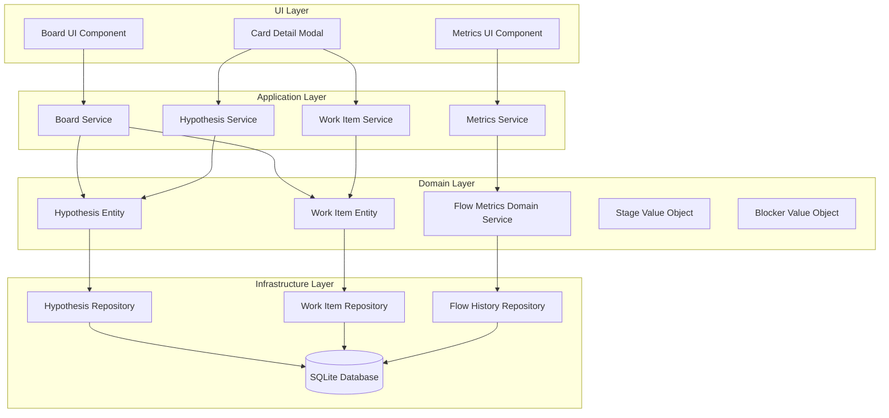
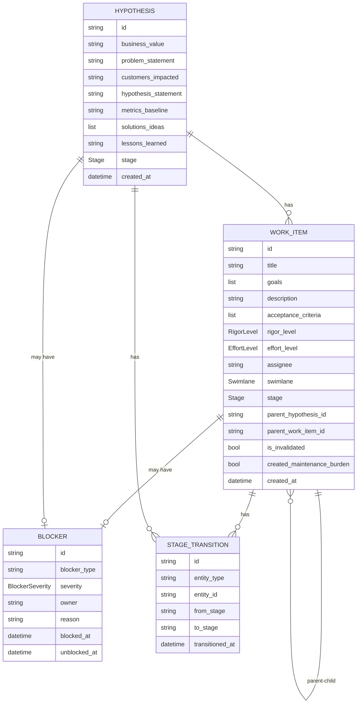

# Design Document: Dual-Board Kanban System

## Overview

The dual-board Kanban system provides a visual management tool for tracking strategic hypotheses and their associated tactical experiments. The system consists of two interconnected boards:

1. **Strategic Hypothesis Board**: Tracks high-level strategic assumptions through validation stages
2. **Work Delivery Board**: Tracks tactical work items (experiments, maintenance, defects) through delivery stages

The design emphasizes:
- Clear visual linkage between strategy and execution
- Flow metrics for data-driven process improvement
- Hierarchical work breakdown (one level of parent-child relationships)
- Blocking visibility and tracking
- Real-time metrics and trend analysis

### Key Design Principles

1. **Strategy-Execution Alignment**: Every work item must link to a strategic hypothesis, ensuring all work serves strategic goals
2. **Flow Optimization**: Built-in metrics (cycle time, lead time, throughput, blocking ages) enable continuous improvement
3. **Visual Management**: Kanban boards provide at-a-glance status with drill-down details
4. **Hierarchical Decomposition**: Single-level parent-child relationships enable work breakdown without excessive complexity
5. **Clean Architecture**: Domain-driven design with clear separation between domain logic, application services, infrastructure, and UI

## Architecture

### System Layers

The system follows clean architecture principles with four distinct layers:

```
┌─────────────────────────────────────────────────────────┐
│                     UI Layer                             │
│  (Streamlit App, Web App - HTML/CSS/JS)                 │
└─────────────────────────────────────────────────────────┘
                          │
┌─────────────────────────────────────────────────────────┐
│                 Application Layer                        │
│  (Command Handlers, Query Handlers, Services)           │
└─────────────────────────────────────────────────────────┘
                          │
┌─────────────────────────────────────────────────────────┐
│                   Domain Layer                           │
│  (Entities, Value Objects, Domain Services)             │
└─────────────────────────────────────────────────────────┘
                          │
┌─────────────────────────────────────────────────────────┐
│               Infrastructure Layer                       │
│  (SQLite Repositories, Database Schema)                 │
└─────────────────────────────────────────────────────────┘
```

### Component Diagram



## UI/UX Design

### Board Navigation and Layout

#### Dual-Board Navigation
- Tab-based navigation at the top of the application
- Two tabs: "Strategic Board" and "Work Board"
- Active tab is highlighted
- Switching between tabs preserves the state of the previously viewed board

#### Strategic Board Layout
```
┌─────────────────────────────────────────────────────────┐
│  Strategic Board  │  Work Board                          │
├─────────────────────────────────────────────────────────┤
│ In Queue │ Review │ Execution │ Done                    │
├──────────┼────────┼───────────┼────────────────────────┤
│          │        │           │                        │
│ [Card]   │ [Card] │  [Card]   │  [Card]                │
│          │        │           │                        │
└──────────┴────────┴───────────┴────────────────────────┘
```

#### Work Board Layout with Swimlanes
```
┌─────────────────────────────────────────────────────────────────────────────┐
│  Strategic Board  │  Work Board                                              │
├─────────────────────────────────────────────────────────────────────────────┤
│ Queue │ Design │ Design-Review │ Implementation │ CR-Review │ Deploy │ Release │ Done
├─────────────────────────────────────────────────────────────────────────────┤
│ ▼ Strategic Experiments (Value Drivers)                                      │
│ ├─ [Card] [Card] [Card]                                                     │
│ │                                                                             │
│ ▼ Tactical Debt & Cleanup (Value Enablers)                                  │
│ ├─ [Card] [Card]                                                            │
│ │                                                                             │
│ ▼ Defects & Support (Failure Demand)                                        │
│ ├─ [Card]                                                                   │
│                                                                              │
│ Flow Load: 15 units (5 High, 4 Medium, 6 Low)  │  Flow Debt: 3             │
└─────────────────────────────────────────────────────────────────────────────┘
```

### Card Design

#### Hypothesis Card
```
┌──────────────────────────┐
│ We believe that...       │
│ (hypothesis statement)   │
│                          │
│ Linked Work Items:       │
│ • High Rigor: 2          │
│ • Medium Rigor: 1        │
│ • Low Rigor: 3           │
│                          │
│ [Blocked indicator]      │
└──────────────────────────┘
```

#### Work Item Card (without children)
```
┌──────────────────────────┐
│ Task Title               │
│                          │
│ Rigor: High              │
│ Effort: Medium           │
│ Assignee: John           │
│                          │
│ [Blocked indicator]      │
└──────────────────────────┘
```

#### Work Item Card (with children)
```
┌──────────────────────────┐
│ Parent Task Title        │
│                          │
│ Rigor: High              │
│ Effort: Medium           │
│ Assignee: John           │
│                          │
│ [Blocked indicator]      │
│                          │
│ ┌─ 3 children ──────┐   │
│ │ (clickable badge) │   │
│ └──────────────────┘   │
└──────────────────────────┘
```

### Child Count Badge Interaction

When a user clicks the child count badge on a parent card:

1. **Collapsed State**: Badge shows "3 children" or "3 tasks"
2. **Expanded State**: Child cards appear inline below the parent card in a nested view
3. **Visual Indicator**: Badge changes appearance (e.g., arrow pointing down when expanded)
4. **Inline Children Display**: Child cards are displayed with reduced styling, maintaining visual hierarchy

```
┌──────────────────────────────────────────┐
│ Parent Task Title                        │
│ Rigor: High | Effort: Medium             │
│ ▼ 3 children                             │
├──────────────────────────────────────────┤
│ ├─ Child 1: Design                       │
│ ├─ Child 2: Implementation               │
│ └─ Child 3: Done                         │
└──────────────────────────────────────────┘
```

### Detail Page Design

#### Full-Page Detail View (Not Modal)
The detail page is a separate full-page view, not a modal overlay. It includes:

1. **Header Section**
   - Back button and breadcrumb navigation
   - Item title/name
   - Current stage badge
   - Navigation controls (previous/next sibling, parent)

2. **Basic Info Section**
   - For Work Items: Title, Goals, Description, Acceptance Criteria
   - For Hypotheses: Business Value, Problem Statement, Customers Impacted, Hypothesis Statement, Metrics Baseline, Solutions/Ideas, Lessons Learned

3. **Status Section**
   - Current stage
   - Stage transition history
   - Blocker information (if blocked)
   - Effort and Rigor levels (for work items)
   - Assignee (for work items)

4. **Relationships Section**
   - Parent hypothesis link (for work items)
   - Parent work item link (for child work items)
   - Child work items list (for parent work items)
   - Linked work items (for hypotheses)

5. **Metadata Section**
   - Created date
   - Last updated date
   - Swimlane (for work items)
   - Invalidation status (for work items)

#### Breadcrumb Navigation
```
Board > Parent Item > Child Item
```

Each breadcrumb element is clickable and navigates to that item's detail page.

#### Navigation Controls
- Previous/Next sibling buttons (if applicable)
- Parent link (if applicable)
- Back to board button

### Detail Page View Models

```python
@dataclass
class WorkItemDetailView:
    """View model for work item detail page."""
    id: str
    title: str
    goals: List[str]
    description: str
    acceptance_criteria: List[str]
    rigor_level: str
    effort_level: str
    assignee: Optional[str]
    swimlane: str
    stage: str
    stage_history: List[StageTransition]
    
    # Relationships
    parent_hypothesis_id: str
    parent_hypothesis_title: str
    parent_work_item_id: Optional[str]
    parent_work_item_title: Optional[str]
    child_work_items: List[ChildWorkItemSummary]
    
    # Blocking
    blocker: Optional[BlockerDetail]
    
    # Metadata
    created_at: datetime
    updated_at: datetime
    is_invalidated: bool
    created_maintenance_burden: bool
    
    # Navigation
    previous_sibling_id: Optional[str]
    next_sibling_id: Optional[str]
    breadcrumb_path: List[BreadcrumbItem]

@dataclass
class HypothesisDetailView:
    """View model for hypothesis detail page."""
    id: str
    business_value: str
    problem_statement: str
    customers_impacted: str
    hypothesis_statement: str
    metrics_baseline: str
    solutions_ideas: List[str]
    lessons_learned: str
    stage: str
    stage_history: List[StageTransition]
    
    # Relationships
    linked_work_items: List[LinkedWorkItemSummary]
    
    # Blocking
    blocker: Optional[BlockerDetail]
    
    # Metadata
    created_at: datetime
    updated_at: datetime
    
    # Navigation
    breadcrumb_path: List[BreadcrumbItem]

@dataclass
class ChildWorkItemSummary:
    """Summary of a child work item for detail page."""
    id: str
    title: str
    stage: str
    rigor_level: str
    effort_level: str
    assignee: Optional[str]

@dataclass
class LinkedWorkItemSummary:
    """Summary of a linked work item for hypothesis detail page."""
    id: str
    title: str
    stage: str
    rigor_level: str
    effort_level: str
    swimlane: str

@dataclass
class BreadcrumbItem:
    """Item in breadcrumb navigation."""
    id: str
    title: str
    type: str  # BOARD, HYPOTHESIS, WORK_ITEM

@dataclass
class BlockerDetail:
    """Detailed blocker information."""
    blocker_type: str
    severity: str
    owner: str
    reason: str
    blocked_at: datetime
    unblocked_at: Optional[datetime]
    blocking_duration: timedelta
```

### Detail Page Navigation Flow

1. User clicks a card on the board
2. System navigates to detail page with full item information
3. User can click parent/child/sibling links to navigate to related items
4. User can use breadcrumb to navigate back to previous items
5. User can click back button to return to board

This flow allows users to explore related items without returning to the board view.

## Components and Interfaces

### Domain Layer Components

#### 1. Hypothesis Entity

Represents a strategic hypothesis with its validation canvas.

```python
class Hypothesis:
    """
    Strategic hypothesis entity with validation canvas.
    """
    id: HypothesisId
    business_value: str
    problem_statement: str
    customers_impacted: str
    hypothesis_statement: str  # Format: "We believe that [X] will result in [Y]. We will know we've succeeded when [Z]."
    metrics_baseline: str
    solutions_ideas: List[str]
    lessons_learned: str
    stage: Stage
    created_at: datetime
    stage_transitions: List[StageTransition]
    
    def move_to_stage(self, new_stage: Stage) -> None:
        """Move hypothesis to a new stage, recording transition."""
        
    def is_in_active_stage(self) -> bool:
        """Check if hypothesis is in an active stage (Design, Implementation)."""
        
    def get_linked_work_items_summary(self) -> Dict[str, Dict[str, int]]:
        """Get count of linked work items by rigor and effort level."""
```

#### 2. WorkItem Entity

Represents a tactical work item (experiment, task, or defect).

```python
class WorkItem:
    """
    Work item entity representing tactical execution.
    """
    id: WorkItemId
    title: str
    goals: List[str]
    description: str
    acceptance_criteria: List[str]
    rigor_level: RigorLevel  # HIGH, MEDIUM, LOW
    effort_level: EffortLevel  # HIGH, MEDIUM, LOW
    assignee: Optional[str]
    swimlane: Swimlane  # STRATEGIC_EXPERIMENTS, TACTICAL_DEBT, DEFECTS_SUPPORT
    stage: Stage
    parent_hypothesis_id: HypothesisId
    parent_work_item_id: Optional[WorkItemId]
    child_work_item_ids: List[WorkItemId]
    created_at: datetime
    stage_transitions: List[StageTransition]
    blocker: Optional[Blocker]
    is_invalidated: bool
    created_maintenance_burden: bool
    
    def move_to_stage(self, new_stage: Stage) -> None:
        """Move work item to a new stage, recording transition."""
        
    def is_in_active_stage(self) -> bool:
        """Check if work item is in an active stage."""
        
    def mark_blocked(self, blocker: Blocker) -> None:
        """Mark work item as blocked with blocker details."""
        
    def unblock(self) -> None:
        """Remove blocked status and record unblock time."""
        
    def can_have_children(self) -> bool:
        """Check if work item can have children (no parent)."""
        
    def can_have_parent(self) -> bool:
        """Check if work item can have a parent (no children)."""
        
    def add_child(self, child_id: WorkItemId) -> None:
        """Add a child work item."""
        
    def set_parent(self, parent_id: WorkItemId) -> None:
        """Set parent work item."""
        
    def check_children_completion(self, work_item_repo: WorkItemRepository) -> bool:
        """Check if all children are in Done stage."""
        
    def get_effort_units(self) -> int:
        """Get numeric effort units (High=3, Medium=2, Low=1)."""
        
    def get_child_count(self) -> int:
        """Get count of child work items."""
```

#### 3. Stage Value Object

Represents a stage in the workflow.

```python
class Stage:
    """
    Value object representing a workflow stage.
    """
    name: str
    board_type: BoardType  # STRATEGIC, WORK_DELIVERY
    is_active: bool
    order: int
    
    @staticmethod
    def get_strategic_stages() -> List[Stage]:
        """Get ordered list of strategic board stages: In Queue, Review, Execution, Done."""
        
    @staticmethod
    def get_work_delivery_stages() -> List[Stage]:
        """Get ordered list of work delivery board stages."""
        
    def is_adjacent_to(self, other: Stage) -> bool:
        """Check if this stage is adjacent to another stage."""
```

#### 4. Blocker Value Object

Represents a blocking impediment.

```python
class Blocker:
    """
    Value object representing a blocker.
    """
    blocker_type: str
    severity: BlockerSeverity  # HIGH, MEDIUM, LOW
    owner: str
    reason: str
    blocked_at: datetime
    unblocked_at: Optional[datetime]
    
    def get_blocking_duration(self) -> timedelta:
        """Calculate duration of blocking."""
```

#### 5. FlowMetrics Domain Service

Calculates flow metrics from work item history.

```python
class FlowMetricsService:
    """
    Domain service for calculating flow metrics.
    """
    
    def calculate_cycle_time(self, work_items: List[WorkItem]) -> CycleTimeMetrics:
        """Calculate cycle time statistics (Design → Done)."""
        
    def calculate_lead_time(self, work_items: List[WorkItem]) -> LeadTimeMetrics:
        """Calculate lead time statistics (Queue → Done)."""
        
    def calculate_throughput(
        self, 
        work_items: List[WorkItem], 
        cadence: Cadence
    ) -> ThroughputMetrics:
        """Calculate throughput for given cadence."""
        
    def calculate_blocking_ages(
        self, 
        work_items: List[WorkItem],
        hypotheses: List[Hypothesis]
    ) -> BlockingAgeMetrics:
        """Calculate blocking age statistics."""
        
    def calculate_flow_load(self, work_items: List[WorkItem]) -> FlowLoadMetrics:
        """Calculate current flow load (total effort units in system)."""
        
    def calculate_flow_debt(self, work_items: List[WorkItem]) -> int:
        """Calculate flow debt (invalidated experiments with maintenance burden)."""
```

### Application Layer Components

#### 1. BoardService

Handles board operations and state management.

```python
class BoardService:
    """
    Application service for board operations.
    """
    
    def get_strategic_board(self) -> StrategicBoardView:
        """Get strategic board with all hypotheses."""
        
    def get_work_delivery_board(self) -> WorkDeliveryBoardView:
        """Get work delivery board with all work items."""
        
    def move_hypothesis(
        self, 
        hypothesis_id: HypothesisId, 
        target_stage: Stage
    ) -> None:
        """Move hypothesis to target stage."""
        
    def move_work_item(
        self, 
        work_item_id: WorkItemId, 
        target_stage: Stage
    ) -> None:
        """Move work item to target stage, check parent completion."""
```

#### 2. HypothesisService

Handles hypothesis-specific operations.

```python
class HypothesisService:
    """
    Application service for hypothesis operations.
    """
    
    def create_hypothesis(self, canvas_data: HypothesisCanvasData) -> HypothesisId:
        """Create new hypothesis with canvas data."""
        
    def update_hypothesis(
        self, 
        hypothesis_id: HypothesisId, 
        canvas_data: HypothesisCanvasData
    ) -> None:
        """Update hypothesis canvas data."""
        
    def get_hypothesis_details(self, hypothesis_id: HypothesisId) -> HypothesisDetailView:
        """Get hypothesis details with linked work items."""
        
    def get_linked_work_items_summary(
        self, 
        hypothesis_id: HypothesisId
    ) -> Dict[str, Dict[str, int]]:
        """Get work items summary by rigor and effort level."""
```

#### 3. WorkItemService

Handles work item operations.

```python
class WorkItemService:
    """
    Application service for work item operations.
    """
    
    def create_work_item(self, work_item_data: WorkItemData) -> WorkItemId:
        """Create new work item."""
        
    def update_work_item(
        self, 
        work_item_id: WorkItemId, 
        work_item_data: WorkItemData
    ) -> None:
        """Update work item data."""
        
    def get_work_item_details(self, work_item_id: WorkItemId) -> WorkItemDetailView:
        """Get work item details."""
        
    def mark_blocked(
        self, 
        work_item_id: WorkItemId, 
        blocker_data: BlockerData
    ) -> None:
        """Mark work item as blocked."""
        
    def unblock(self, work_item_id: WorkItemId) -> None:
        """Unblock work item."""
        
    def add_child_work_item(
        self, 
        parent_id: WorkItemId, 
        child_id: WorkItemId
    ) -> None:
        """Add child work item to parent."""
        
    def mark_invalidated(
        self, 
        work_item_id: WorkItemId, 
        created_maintenance: bool
    ) -> None:
        """Mark work item as invalidated."""
```

#### 4. MetricsService

Handles metrics calculation and retrieval.

```python
class MetricsService:
    """
    Application service for metrics operations.
    """
    
    def get_cycle_time_metrics(
        self, 
        filters: MetricsFilters
    ) -> CycleTimeMetrics:
        """Get cycle time metrics with filters."""
        
    def get_lead_time_metrics(
        self, 
        filters: MetricsFilters
    ) -> LeadTimeMetrics:
        """Get lead time metrics with filters."""
        
    def get_throughput_metrics(
        self, 
        cadence: Cadence, 
        filters: MetricsFilters
    ) -> ThroughputMetrics:
        """Get throughput metrics with cadence and filters."""
        
    def get_blocking_age_metrics(
        self, 
        filters: MetricsFilters
    ) -> BlockingAgeMetrics:
        """Get blocking age metrics with filters."""
        
    def get_flow_load(self) -> FlowLoadMetrics:
        """Get current flow load."""
        
    def get_flow_debt(self) -> FlowDebtMetrics:
        """Get current flow debt."""
        
    def export_metrics_csv(self, filters: MetricsFilters) -> str:
        """Export metrics data as CSV."""
```

#### 5. DetailPageService

Handles detail page data retrieval and navigation.

```python
class DetailPageService:
    """
    Application service for detail page operations.
    """
    
    def get_work_item_detail(self, work_item_id: WorkItemId) -> WorkItemDetailView:
        """Get work item detail view with all relationships and navigation data."""
        
    def get_hypothesis_detail(self, hypothesis_id: HypothesisId) -> HypothesisDetailView:
        """Get hypothesis detail view with all relationships and navigation data."""
        
    def get_breadcrumb_path(
        self, 
        item_id: str, 
        item_type: str,
        navigation_history: List[str]
    ) -> List[BreadcrumbItem]:
        """Get breadcrumb navigation path."""
        
    def get_sibling_navigation(
        self, 
        work_item_id: WorkItemId
    ) -> Tuple[Optional[WorkItemId], Optional[WorkItemId]]:
        """Get previous and next sibling IDs for navigation."""
```

### Infrastructure Layer Components

#### 1. HypothesisRepository

Persists and retrieves hypotheses.

```python
class HypothesisRepository:
    """
    Repository for hypothesis persistence.
    """
    
    def save(self, hypothesis: Hypothesis) -> None:
        """Save hypothesis to database."""
        
    def find_by_id(self, hypothesis_id: HypothesisId) -> Optional[Hypothesis]:
        """Find hypothesis by ID."""
        
    def find_all(self) -> List[Hypothesis]:
        """Find all hypotheses."""
        
    def find_by_stage(self, stage: Stage) -> List[Hypothesis]:
        """Find hypotheses in specific stage."""
```

#### 2. WorkItemRepository

Persists and retrieves work items.

```python
class WorkItemRepository:
    """
    Repository for work item persistence.
    """
    
    def save(self, work_item: WorkItem) -> None:
        """Save work item to database."""
        
    def find_by_id(self, work_item_id: WorkItemId) -> Optional[WorkItem]:
        """Find work item by ID."""
        
    def find_all(self) -> List[WorkItem]:
        """Find all work items."""
        
    def find_by_hypothesis(self, hypothesis_id: HypothesisId) -> List[WorkItem]:
        """Find work items linked to hypothesis."""
        
    def find_by_parent(self, parent_id: WorkItemId) -> List[WorkItem]:
        """Find child work items of parent."""
        
    def find_not_done(self) -> List[WorkItem]:
        """Find work items not in Done stage."""
        
    def find_completed_in_period(
        self, 
        start_date: datetime, 
        end_date: datetime
    ) -> List[WorkItem]:
        """Find work items completed in date range."""
```

#### 3. FlowHistoryRepository

Persists flow metrics history for trend analysis.

```python
class FlowHistoryRepository:
    """
    Repository for flow metrics history.
    """
    
    def save_snapshot(self, snapshot: FlowMetricsSnapshot) -> None:
        """Save metrics snapshot."""
        
    def find_snapshots_in_period(
        self, 
        start_date: datetime, 
        end_date: datetime
    ) -> List[FlowMetricsSnapshot]:
        """Find snapshots in date range."""
```

## Data Models

### API Endpoints

#### Detail Page Endpoints

```
GET /api/work-items/{id}/detail
Response: WorkItemDetailView
- Includes all basic info, status, relationships, metadata
- Includes child work items list
- Includes parent work item link
- Includes parent hypothesis link
- Includes breadcrumb navigation data
- Includes sibling navigation data

GET /api/hypotheses/{id}/detail
Response: HypothesisDetailView
- Includes all canvas fields
- Includes linked work items list
- Includes breadcrumb navigation data

GET /api/work-items/{id}/children
Response: List[ChildWorkItemSummary]
- Returns all child work items with stage, rigor, effort, assignee

GET /api/work-items/{id}/siblings
Response: Tuple[Optional[WorkItemId], Optional[WorkItemId]]
- Returns previous and next sibling IDs for navigation
```

#### Child Count Badge Endpoints

```
GET /api/work-items/{id}/child-count
Response: { count: int, children: List[ChildWorkItemSummary] }
- Returns child count and list of children for inline expansion

POST /api/work-items/{parent-id}/children/{child-id}
Request: { }
Response: { success: bool, child_count: int }
- Adds child to parent, returns updated child count

DELETE /api/work-items/{parent-id}/children/{child-id}
Response: { success: bool, child_count: int }
- Removes child from parent, returns updated child count
```

#### Stage Transition with Parent Auto-Update Endpoints

```
POST /api/work-items/{id}/move-to-stage
Request: { target_stage: string }
Response: { 
    success: bool, 
    work_item: WorkItemCardView,
    parent_updated: bool,
    parent: Optional[WorkItemCardView]
}
- Moves work item to target stage
- If work item has parent, automatically updates parent stage
- Returns both work item and parent updates
```

### Database Schema

```sql
-- Hypotheses table
CREATE TABLE hypotheses (
    id TEXT PRIMARY KEY,
    business_value TEXT NOT NULL,
    problem_statement TEXT NOT NULL,
    customers_impacted TEXT NOT NULL,
    hypothesis_statement TEXT NOT NULL,
    metrics_baseline TEXT NOT NULL,
    solutions_ideas TEXT NOT NULL,  -- JSON array
    lessons_learned TEXT,
    stage TEXT NOT NULL,
    created_at TIMESTAMP NOT NULL,
    updated_at TIMESTAMP NOT NULL
);

-- Work items table
CREATE TABLE work_items (
    id TEXT PRIMARY KEY,
    title TEXT NOT NULL,
    goals TEXT NOT NULL,  -- JSON array
    description TEXT NOT NULL,
    acceptance_criteria TEXT NOT NULL,  -- JSON array
    rigor_level TEXT NOT NULL,  -- HIGH, MEDIUM, LOW
    effort_level TEXT NOT NULL,  -- HIGH, MEDIUM, LOW
    assignee TEXT,
    swimlane TEXT NOT NULL,  -- STRATEGIC_EXPERIMENTS, TACTICAL_DEBT, DEFECTS_SUPPORT
    stage TEXT NOT NULL,
    parent_hypothesis_id TEXT NOT NULL,
    parent_work_item_id TEXT,
    is_invalidated BOOLEAN DEFAULT FALSE,
    created_maintenance_burden BOOLEAN DEFAULT FALSE,
    created_at TIMESTAMP NOT NULL,
    updated_at TIMESTAMP NOT NULL,
    FOREIGN KEY (parent_hypothesis_id) REFERENCES hypotheses(id),
    FOREIGN KEY (parent_work_item_id) REFERENCES work_items(id)
);

-- Work item children (junction table for parent-child relationships)
CREATE TABLE work_item_children (
    parent_id TEXT NOT NULL,
    child_id TEXT NOT NULL,
    PRIMARY KEY (parent_id, child_id),
    FOREIGN KEY (parent_id) REFERENCES work_items(id),
    FOREIGN KEY (child_id) REFERENCES work_items(id)
);

-- Stage transitions table
CREATE TABLE stage_transitions (
    id TEXT PRIMARY KEY,
    entity_type TEXT NOT NULL,  -- HYPOTHESIS, WORK_ITEM
    entity_id TEXT NOT NULL,
    from_stage TEXT,
    to_stage TEXT NOT NULL,
    transitioned_at TIMESTAMP NOT NULL
);

-- Blockers table
CREATE TABLE blockers (
    id TEXT PRIMARY KEY,
    entity_type TEXT NOT NULL,  -- HYPOTHESIS, WORK_ITEM
    entity_id TEXT NOT NULL,
    blocker_type TEXT NOT NULL,
    severity TEXT NOT NULL,  -- HIGH, MEDIUM, LOW
    owner TEXT NOT NULL,
    reason TEXT NOT NULL,
    blocked_at TIMESTAMP NOT NULL,
    unblocked_at TIMESTAMP
);

-- Flow metrics snapshots table
CREATE TABLE flow_metrics_snapshots (
    id TEXT PRIMARY KEY,
    snapshot_date TIMESTAMP NOT NULL,
    cycle_time_avg REAL,
    cycle_time_median REAL,
    cycle_time_p50 REAL,
    cycle_time_p75 REAL,
    cycle_time_p90 REAL,
    lead_time_avg REAL,
    lead_time_median REAL,
    lead_time_p50 REAL,
    lead_time_p75 REAL,
    lead_time_p90 REAL,
    throughput_count INTEGER,
    throughput_cadence TEXT,
    flow_load INTEGER,
    flow_debt INTEGER,
    blocking_age_total REAL,
    blocking_age_avg REAL,
    blocking_count INTEGER
);
```

### Domain Model Relationships



### View Models

View models represent data structures optimized for UI display.

```python
@dataclass
class HypothesisCardView:
    """View model for hypothesis card on board."""
    id: str
    title: str  # Derived from hypothesis_statement
    stage: str
    work_items_summary: Dict[str, Dict[str, int]]  # {rigor: {effort: count}}
    is_blocked: bool

@dataclass
class WorkItemCardView:
    """View model for work item card on board."""
    id: str
    title: str
    rigor_level: str
    effort_level: str
    assignee: Optional[str]
    stage: str
    swimlane: str
    parent_hypothesis_id: str
    child_count: int
    has_parent: bool
    is_blocked: bool

@dataclass
class StrategicBoardView:
    """View model for strategic board."""
    stages: List[str]
    hypotheses_by_stage: Dict[str, List[HypothesisCardView]]

@dataclass
class WorkDeliveryBoardView:
    """View model for work delivery board."""
    stages: List[str]
    swimlanes: List[str]
    work_items_by_stage_and_swimlane: Dict[str, Dict[str, List[WorkItemCardView]]]
    flow_load: FlowLoadMetrics
    flow_debt: int

@dataclass
class FlowLoadMetrics:
    """View model for flow load metrics."""
    total_effort_units: int
    high_effort_count: int
    medium_effort_count: int
    low_effort_count: int
    has_high_concentration: bool  # True if >50% are high effort

@dataclass
class CycleTimeMetrics:
    """View model for cycle time metrics."""
    average_days: float
    median_days: float
    p50_days: float
    p75_days: float
    p90_days: float
    trend_data: List[Tuple[datetime, float]]  # For charting

@dataclass
class LeadTimeMetrics:
    """View model for lead time metrics."""
    average_days: float
    median_days: float
    p50_days: float
    p75_days: float
    p90_days: float
    trend_data: List[Tuple[datetime, float]]

@dataclass
class ThroughputMetrics:
    """View model for throughput metrics."""
    count: int
    cadence: str
    trend_data: List[Tuple[datetime, int]]

@dataclass
class BlockingAgeMetrics:
    """View model for blocking age metrics."""
    total_hours_blocked: float
    average_block_duration_hours: float
    block_count: int
    active_stage_blocking_hours: float
    inactive_stage_blocking_hours: float
```


## Correctness Properties

*A property is a characteristic or behavior that should hold true across all valid executions of a system—essentially, a formal statement about what the system should do. Properties serve as the bridge between human-readable specifications and machine-verifiable correctness guarantees.*

### Property 1: Hypothesis Creation Initialization
*For any* hypothesis created with valid canvas data, the hypothesis should be placed in the "In Queue" stage.
**Validates: Requirements 2.2**

### Property 2: Work Item Creation Initialization
*For any* work item created with valid data, the work item should be placed in the "Queue" stage within its specified swimlane.
**Validates: Requirements 3.3**

### Property 3: Adjacent Stage Transitions
*For any* hypothesis or work item, moving between stages should only succeed when the target stage is adjacent to the current stage.
**Validates: Requirements 2.3, 3.4, 17.3**

### Property 4: Active Stage Classification
*For any* hypothesis in Design or Implementation stages, the system should classify it as being in an active stage. *For any* work item in Design-Review, CR-Review, Deploy, or Release stages, the system should classify it as being in an active stage.
**Validates: Requirements 2.4, 3.5**

### Property 5: Hypothesis Statement Format Validation
*For any* hypothesis statement input, the system should accept it only if it follows the format "We believe that [X] will result in [Y]. We will know we've succeeded when [Z]." where X, Y, and Z are non-empty.
**Validates: Requirements 4.5**

### Property 6: Effort Level Value Mapping
*For any* work item, the effort level should map to numeric values: High=3, Medium=2, Low=1.
**Validates: Requirements 13.2**

### Property 7: Work Item Requires Parent Hypothesis
*For any* work item creation attempt, the system should reject it if no parent hypothesis is specified.
**Validates: Requirements 6.1, 6.6**

### Property 8: Parent-Child Hierarchy Depth Limit
*For any* work item that has a parent, attempting to add children should fail. *For any* work item that has children, attempting to assign a parent should fail.
**Validates: Requirements 7.3, 7.4, 7.5**

### Property 9: Parent Completion on All Children Done
*For any* parent work item with children, when all children reach Done stage, the parent should automatically transition to Done stage.
**Validates: Requirements 7.6**

### Property 10: Blocking Requires Active Stage
*For any* work item or hypothesis not in an active stage, attempting to mark it as blocked should fail.
**Validates: Requirements 8.1**

### Property 11: Blocking Requires Complete Information
*For any* blocking attempt, the system should reject it if blocker type, severity, owner, or reason is missing.
**Validates: Requirements 8.2**

### Property 12: Blocking Age Calculation
*For any* work item or hypothesis that has been blocked and unblocked, the blocking age should equal the sum of all durations between block start and unblock timestamps, excluding time spent in non-blocked states.
**Validates: Requirements 12.1, 12.4**

### Property 13: Cycle Time Calculation
*For any* work item that has transitioned from Design to Done, the cycle time should equal the duration between entering Design stage and entering Done stage.
**Validates: Requirements 9.1**

### Property 14: Lead Time Calculation
*For any* work item that has transitioned from Queue to Done, the lead time should equal the duration between entering Queue stage and entering Done stage.
**Validates: Requirements 10.1**

### Property 15: Throughput Calculation
*For any* time period and cadence configuration, throughput should equal the count of work items that transitioned to Done stage within that period.
**Validates: Requirements 11.1**

### Property 16: Flow Load Calculation
*For any* set of work items not in Done stage, flow load should equal the sum of effort units (High=3, Medium=2, Low=1) across all those work items.
**Validates: Requirements 13.1**

### Property 17: Flow Load High Concentration Detection
*For any* set of work items not in Done stage, if more than 50% have High effort level, the system should flag high concentration.
**Validates: Requirements 13.4**

### Property 18: Flow Debt Increment
*For any* work item in Strategic Experiments swimlane marked as invalidated with maintenance burden, the flow debt counter should increment by 1.
**Validates: Requirements 14.3**

### Property 19: Hypothesis Persistence Round Trip
*For any* hypothesis with valid canvas data, saving it to the database and then retrieving it by ID should produce an equivalent hypothesis with all fields preserved.
**Validates: Requirements 16.1, 16.4**

### Property 20: Work Item Persistence Round Trip
*For any* work item with valid data, saving it to the database and then retrieving it by ID should produce an equivalent work item with all fields preserved, including parent-child relationships.
**Validates: Requirements 16.2, 16.4**

### Property 21: Stage Transition Recording
*For any* hypothesis or work item moved to a new stage, the system should record a stage transition with the correct from_stage, to_stage, and timestamp.
**Validates: Requirements 17.2**

### Property 22: Active Stage Time Recording
*For any* work item or hypothesis entering an active stage, the system should record the entry timestamp. *For any* work item or hypothesis exiting an active stage, the system should record the exit timestamp.
**Validates: Requirements 17.4, 17.5**

### Property 23: Hypothesis Work Items Summary Accuracy
*For any* hypothesis, the count of linked work items categorized by rigor and effort level should match the actual count of work items linked to that hypothesis in each category.
**Validates: Requirements 6.5**

### Property 24: Metrics Filter Application
*For any* metrics query with filters (swimlane, date range, assignee), the returned data should include only work items matching all specified filter criteria.
**Validates: Requirements 15.4**

### Property 25: Cadence Recalculation Reactivity
*For any* throughput metrics view, changing the cadence configuration should immediately recalculate throughput using the new cadence.
**Validates: Requirements 11.5**

### Property 26: Child Work Item Stage Movement
*For any* parent work item with children, when a child work item is moved to an adjacent stage, the child's stage should update successfully.
**Validates: Requirements 18.1**

### Property 27: Parent Auto-Update on Child Stage Change
*For any* parent work item with children, when a child moves to a new stage, the parent should automatically update according to these rules: if all children are in Done, parent moves to Done; else if any child is in Implementation, parent moves to Implementation; else parent remains in current stage.
**Validates: Requirements 18.2**

### Property 28: Stage Transition Recording for Parent-Child
*For any* child work item moved to a new stage, both the child and parent stage transitions should be recorded with correct timestamps.
**Validates: Requirements 18.3**

### Property 29: Child Stage Movement Adjacency Validation
*For any* child work item, attempting to move it to a non-adjacent stage should fail.
**Validates: Requirements 18.4**

### Property 30: Detail Page Data Completeness
*For any* work item or hypothesis, retrieving its detail view should include all required sections: Basic Info, Status, Relationships, and Metadata.
**Validates: Requirements 19.3**

### Property 31: Detail Page Relationship Links
*For any* work item detail view, all parent, child, and linked hypothesis relationships should be included as clickable link data (IDs and titles).
**Validates: Requirements 19.4, 19.5**

### Property 32: Breadcrumb Navigation Data
*For any* detail page view, the breadcrumb path should accurately represent the navigation history from board to current item.
**Validates: Requirements 19.7**

### Property 33: Sibling Navigation Data
*For any* work item that has siblings (other children of the same parent), the detail view should include previous and next sibling IDs for navigation.
**Validates: Requirements 19.8**

### Property 34: Child Count Display on Parent Cards
*For any* parent work item with children, the card view should include a child count field with the correct count.
**Validates: Requirements 20.1**

### Property 35: No Child Count on Hypothesis Cards
*For any* hypothesis card view, the child count field should not be present or should be null/zero.
**Validates: Requirements 20.2**

### Property 36: Child Count Badge Formatting
*For any* parent work item with children, the child count should be formatted as a string (e.g., "3 children" or "3 tasks").
**Validates: Requirements 20.3**

### Property 37: No Child Count Badge for Childless Items
*For any* work item with no children, the child count field should be null or zero, indicating no badge should be displayed.
**Validates: Requirements 20.4**

### Property 38: Child Count Badge Expandable Data
*For any* parent work item with children, the card view should include the list of all child work items for inline expansion.
**Validates: Requirements 20.5, 20.6**

### Property 39: Child Count Real-Time Update
*For any* parent work item, when a child is added or removed, the child count in the card view should be updated to reflect the new count.
**Validates: Requirements 20.7**

## Error Handling

### Domain-Level Errors

The system should handle these domain-level error conditions:

1. **Invalid Stage Transitions**
   - Error: Attempting to move to non-adjacent stage
   - Handling: Reject transition, return error message indicating valid adjacent stages
   - User feedback: "Cannot move directly to [target]. Valid next stages are: [list]"

2. **Invalid Hypothesis Statement Format**
   - Error: Hypothesis statement doesn't match required format
   - Handling: Reject creation/update, return validation error
   - User feedback: "Hypothesis statement must follow format: 'We believe that [X] will result in [Y]. We will know we've succeeded when [Z].'"

3. **Missing Parent Hypothesis**
   - Error: Attempting to create work item without parent hypothesis
   - Handling: Reject creation, return validation error
   - User feedback: "Work item must be linked to a parent hypothesis"

4. **Invalid Parent-Child Hierarchy**
   - Error: Attempting to add children to a child work item, or parent to a parent work item
   - Handling: Reject operation, return validation error
   - User feedback: "Work items can only have one level of parent-child relationships"

5. **Blocking Non-Active Stage**
   - Error: Attempting to mark item as blocked when not in active stage
   - Handling: Reject blocking, return error
   - User feedback: "Only items in active stages can be marked as blocked"

6. **Incomplete Blocker Information**
   - Error: Missing required blocker fields (type, severity, owner, reason)
   - Handling: Reject blocking, return validation error
   - User feedback: "All blocker fields are required: type, severity, owner, reason"

### Infrastructure-Level Errors

1. **Database Connection Failures**
   - Handling: Retry with exponential backoff (3 attempts)
   - User feedback: "Unable to save changes. Please try again."
   - Logging: Log connection errors with stack trace

2. **Database Constraint Violations**
   - Handling: Catch foreign key violations, unique constraint violations
   - User feedback: Translate technical errors to user-friendly messages
   - Example: "Cannot delete hypothesis with linked work items"

3. **Data Corruption**
   - Handling: Validate data integrity on load
   - User feedback: "Data integrity issue detected. Please contact support."
   - Logging: Log corruption details for investigation

### UI-Level Errors

1. **Network Failures** (for web app)
   - Handling: Display offline indicator, queue changes for retry
   - User feedback: "You are offline. Changes will be saved when connection is restored."

2. **Invalid User Input**
   - Handling: Client-side validation before submission
   - User feedback: Inline validation messages on form fields
   - Example: "Title is required", "Effort level must be High, Medium, or Low"

## Testing Strategy

### Dual Testing Approach

The system requires both unit testing and property-based testing for comprehensive coverage:

- **Unit tests**: Verify specific examples, edge cases, and error conditions
- **Property tests**: Verify universal properties across all inputs

Together, these approaches provide comprehensive coverage where unit tests catch concrete bugs and property tests verify general correctness.

### Property-Based Testing

**Library Selection**: Use `hypothesis` library for Python (property-based testing framework)

**Configuration**:
- Minimum 100 iterations per property test
- Each property test must reference its design document property
- Tag format: `# Feature: dual-board-kanban, Property {number}: {property_text}`

**Property Test Implementation**:
- Each correctness property (Properties 1-39) must be implemented as a single property-based test
- Use generators to create random valid inputs (hypotheses, work items, stage transitions)
- Use strategies for constrained generation (e.g., valid hypothesis statements, valid stage sequences)

**Example Property Test Structure**:
```python
from hypothesis import given, strategies as st

@given(
    hypothesis_data=st.builds(
        HypothesisCanvasData,
        business_value=st.text(min_size=1),
        problem_statement=st.text(min_size=1),
        # ... other fields
    )
)
def test_property_1_hypothesis_creation_initialization(hypothesis_data):
    """
    Feature: dual-board-kanban, Property 1: Hypothesis Creation Initialization
    For any hypothesis created with valid canvas data, 
    the hypothesis should be placed in the "In Queue" stage.
    """
    service = HypothesisService()
    hypothesis_id = service.create_hypothesis(hypothesis_data)
    hypothesis = service.get_hypothesis_details(hypothesis_id)
    
    assert hypothesis.stage == "In Queue"
```

### Unit Testing

**Focus Areas**:
- Specific examples demonstrating correct behavior
- Edge cases (empty lists, boundary values, null handling)
- Error conditions (invalid inputs, constraint violations)
- Integration points between components

**Example Unit Test Structure**:
```python
def test_create_hypothesis_with_minimal_data():
    """Test hypothesis creation with minimal required data."""
    service = HypothesisService()
    canvas_data = HypothesisCanvasData(
        business_value="Increase revenue",
        problem_statement="Users churn too quickly",
        customers_impacted="All users",
        hypothesis_statement="We believe that adding feature X will result in reduced churn. We will know we've succeeded when churn drops by 10%.",
        metrics_baseline="Current churn: 20%",
        solutions_ideas=["Feature X"],
        lessons_learned=""
    )
    
    hypothesis_id = service.create_hypothesis(canvas_data)
    assert hypothesis_id is not None

def test_work_item_cannot_have_parent_and_children():
    """Test that work items cannot have both parent and children."""
    service = WorkItemService()
    
    # Create parent work item
    parent_id = service.create_work_item(create_test_work_item_data())
    
    # Create child work item
    child_id = service.create_work_item(create_test_work_item_data())
    
    # Add child to parent
    service.add_child_work_item(parent_id, child_id)
    
    # Attempt to add grandchild to child (should fail)
    grandchild_id = service.create_work_item(create_test_work_item_data())
    
    with pytest.raises(ValidationError, match="cannot have children"):
        service.add_child_work_item(child_id, grandchild_id)
```

### Integration Testing

**Focus Areas**:
- End-to-end workflows (create hypothesis → create work items → move through stages → complete)
- Cross-component interactions (board service → domain entities → repositories)
- Database persistence and retrieval
- Metrics calculation across multiple entities

**Example Integration Test**:
```python
def test_complete_workflow_hypothesis_to_done():
    """Test complete workflow from hypothesis creation to completion."""
    # Create hypothesis
    hypothesis_service = HypothesisService()
    hypothesis_id = hypothesis_service.create_hypothesis(create_test_canvas_data())
    
    # Create work items linked to hypothesis
    work_item_service = WorkItemService()
    work_item_ids = [
        work_item_service.create_work_item(
            create_test_work_item_data(parent_hypothesis_id=hypothesis_id)
        )
        for _ in range(3)
    ]
    
    # Move work items through stages
    board_service = BoardService()
    for work_item_id in work_item_ids:
        for stage in ["Design", "Design-Review", "Implementation", "CR-Review", "Deploy", "Release", "Done"]:
            board_service.move_work_item(work_item_id, Stage(stage))
    
    # Verify metrics
    metrics_service = MetricsService()
    throughput = metrics_service.get_throughput_metrics(
        Cadence(weeks=1),
        MetricsFilters()
    )
    
    assert throughput.count == 3
```

### Test Coverage Goals

- **Unit test coverage**: Minimum 80% code coverage
- **Property test coverage**: All 39 correctness properties implemented
- **Integration test coverage**: All major workflows covered
- **Error handling coverage**: All error conditions tested

### Continuous Testing

- Run unit tests on every commit
- Run property tests (with reduced iterations for speed) on every commit
- Run full property test suite (100+ iterations) nightly
- Run integration tests before deployment
